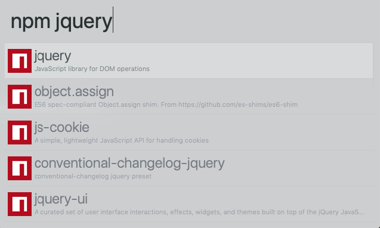

# alfred-npmjs

> [Alfred 3](https://www.alfredapp.com) workflow to search for npm packages with [npmsjs](https://npmjs.com)





## Install

```
$ npm install --global alfred-npmjs
```

*Requires [Node.js](https://nodejs.org) 8+ and the Alfred [Powerpack](https://www.alfredapp.com/powerpack/).*


## Usage

In Alfred, type `npm`, <kbd>Enter</kbd>, and your query, to search for packages.

Select a package and press <kbd>Enter</kbd> to go to its GitHub repo.<br>
Hold <kbd>Alt</kbd> when pressing <kbd>Enter</kbd> to go to its npm page.<br>
Hold <kbd>Command</kbd> to display additional information.<br>
Press <kbd>Shift</kbd> to view its readme in Quick Look.

## Thanks

This project is a fork, adapted for npm.js, from the [alfred-npms ](alfred-npms)project of [Sindre Sorhus](https://github.com/sindresorhus). 


## License

MIT © [Sindre Sorhus](https://sindresorhus.com)
